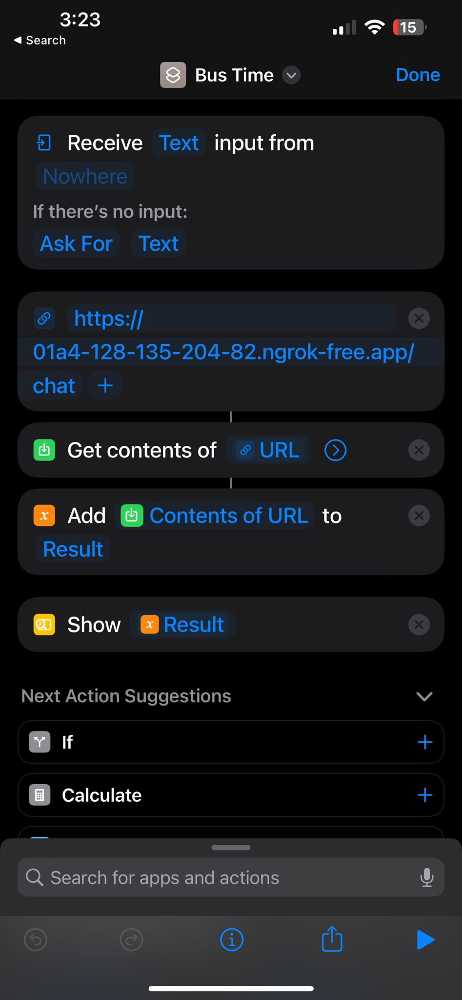

# Chicago Bus Data via Siri

## Purpose

This repository enables users to interact with Siri to ask about live bus data in Chicago. The system uses Siri shortcuts, OpenAI and Google APIs, and local stop data to provide up-to-date bus route information based on user queries.

## Overview

### Design

#### Entry Point

The user interaction begins with a Siri Shortcut that accepts free-form text input. Below is a screenshot of the Siri Shortcut setup:

#### Data Processing

The free-form text from the user is sent to the **OpenAI API** to extract key pieces of information such as:
- Address
- Route number
- Direction of travel

These inputs are essential for querying the subsequent APIs.

##### Setting up OpenAI API Account

To use the OpenAI API, follow these steps to create an account and obtain your API key:
- Visit [OpenAI](https://beta.openai.com/signup/) and sign up for an account.
- Follow the instructions to generate an API key.

#### Geolocation Conversion

The extracted address information is then sent to the **Google GeoLocator API** to convert the address into geographical coordinates (latitude and longitude).

##### Accessing Google GeoLocator API

To set up access to the Google GeoLocator API, you need to:
- Create a project in the [Google Cloud Platform](https://cloud.google.com/)
- Enable the Geocoding API for your project.
- Obtain an API key from the Google Cloud Console.

#### Data Retrieval

With the geographical coordinates, the system queries the CTA data using a custom library provided by the UChicago Transit Datathon. The `stop_data.py` file in this repository is configured to run once daily to fetch an updated list of stops. This local storage of stops ensures optimized query times.

### Deployment

The result from the data processing is served via **SANIC** to a public facing endpoint as free form text, which Siri can then read aloud to the user. 

#### Public Deployment Using ngrok

To deploy the SANIC server publicly:
- Download and setup [ngrok](https://ngrok.com/download).
- Run your SANIC server.
- Use ngrok to tunnel your local server to the web by running `ngrok http 8000` (assuming your SANIC server runs on port 8000).

## Conclusion

This system provides a seamless integration for querying live bus data in Chicago using Siri. It leverages modern APIs and efficient data handling to deliver quick and reliable information directly via voice interaction.

